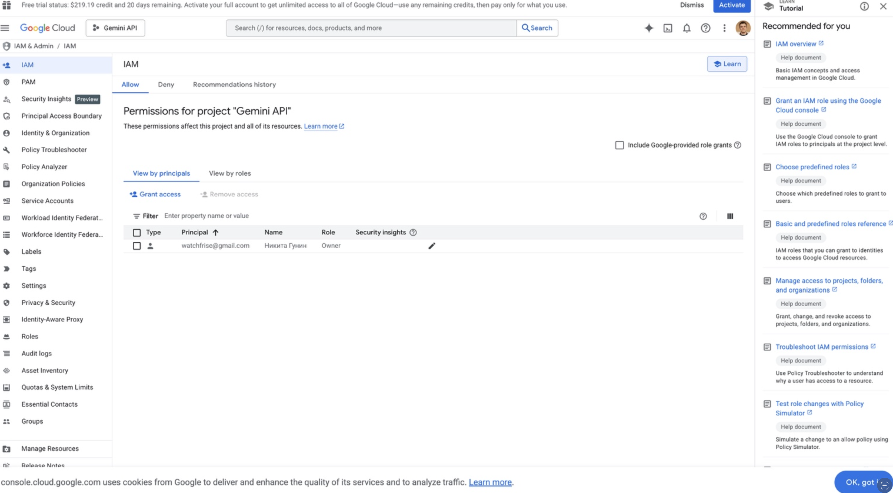
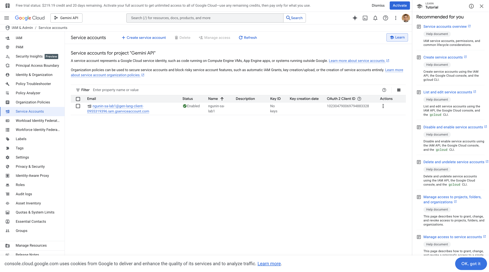
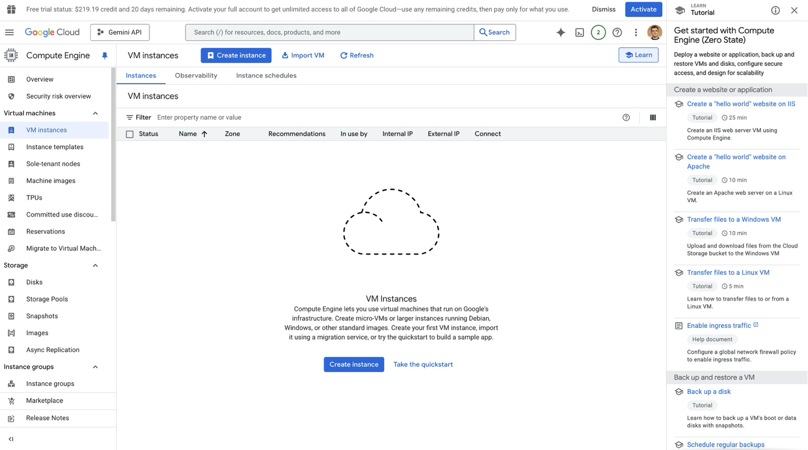
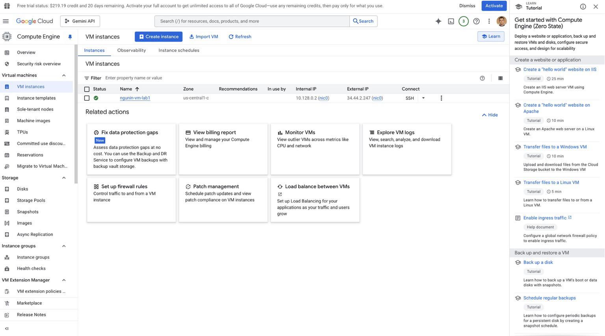
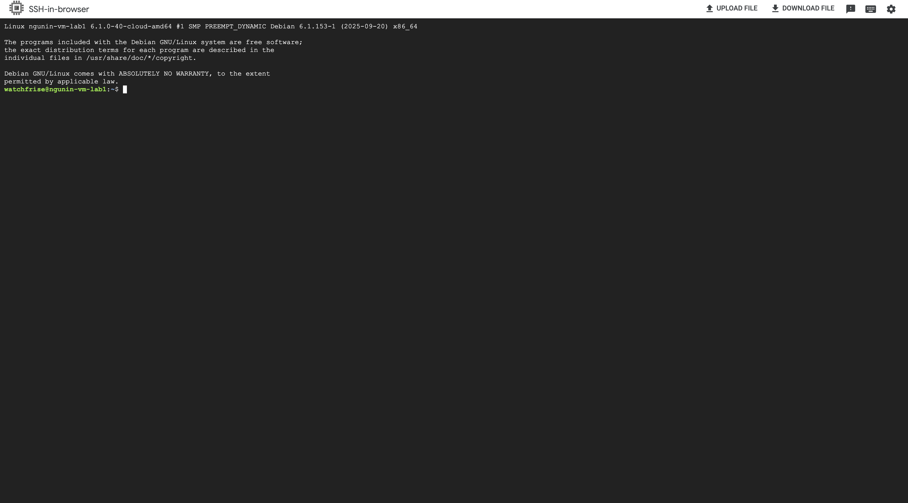
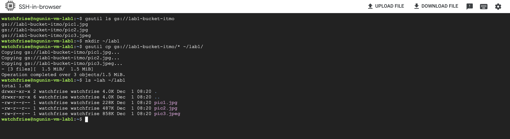
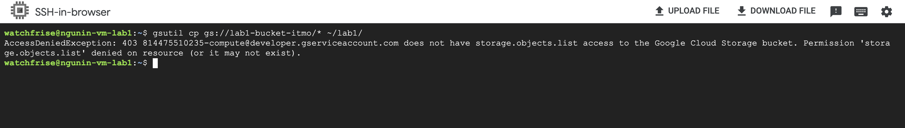

# Отчет по лабораторной №1

University: [ITMO University](https://itmo.ru/ru/)  
Faculty: FTMI  
Course: [introduction-in-web-tech](https://itmo-ict-faculty.github.io/introduction-in-web-tech)  
Year: 2025/2026  
Group: U4225  
Author: Gunin Nikita Alekseevich  
Lab: Lab1  
Date of create: 01.12.2025  
Date of finished: 01.12.2025

---

## Ход работы

### Шаг 1. Открытие IAM и проверка доступа
Сначала я получил доступ к Google Cloud и открыл раздел IAM.

---

### Шаг 2. Создание Service Account с ролью Storage Admin
Я создал сервисный аккаунт `ngunin-sa-lab1` и присвоил ему роль **Storage Admin**.

---

### Шаг 3. Переход на страницу VM Instances
Я открыл панель Compute Engine → VM Instances.

---

### Шаг 4. Создание виртуальной машины (VM)
Я создал минимальную VM типа **e2-micro** в режиме **Spot**.

---

### Шаг 5. Подключение к VM по SSH
Подключение я выполнил через SSH-in-browser.

---

### Шаг 6. Копирование файлов из Google Cloud Storage
Я проверил версию gsutil, нашёл бакет `lab1-bucket-itmo`, создал каталог `~/lab1`, скопировал файлы на VM и проверил их наличие.

---

### Шаг 7. Изменение роли сервисного аккаунта и повторная проверка
Я изменил роль сервисного аккаунта со **Storage Admin** на **Compute Viewer**, что привело к ожидаемой ошибке доступа при повторной попытке копирования.

---

## Результаты лабораторной работы

В ходе выполнения лабораторной работы я выполнил следующие действия:

1. Получил доступ к Google Cloud и открыл IAM.  
2. Создал сервисный аккаунт с корректным неймингом.  
3. Создал минимальную виртуальную машину e2-micro в Spot-режиме.  
4. Выполнил SSH-подключение к VM.  
5. С помощью gsutil скопировал файлы из бакета на виртуальную машину.  
6. После изменения роли на Compute Viewer корректно закрыл доступ к объектам, что подтверждается ошибкой 403.  
7. Все созданные ресурсы я удалил.  

Все пункты работы я выполнил, скриншоты приложил.
