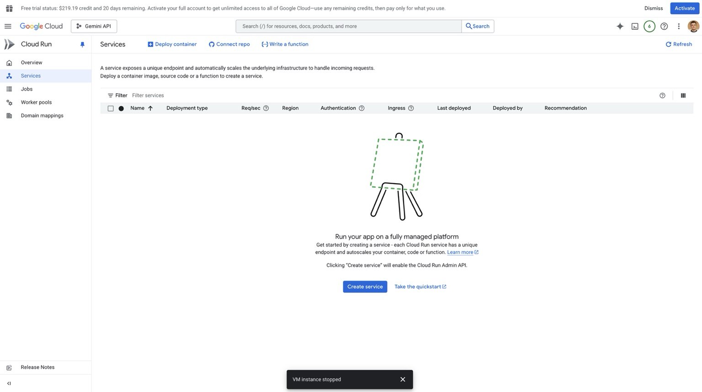
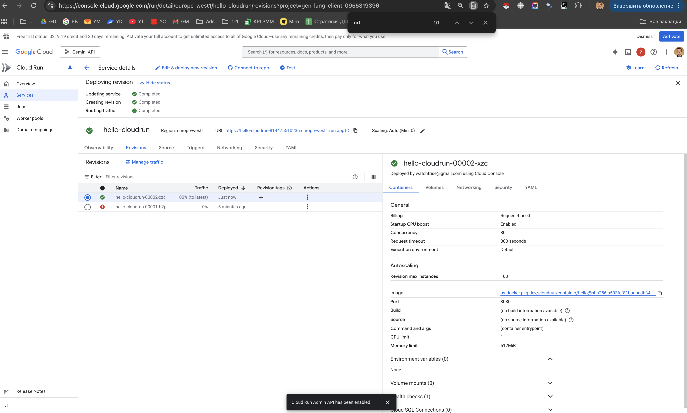
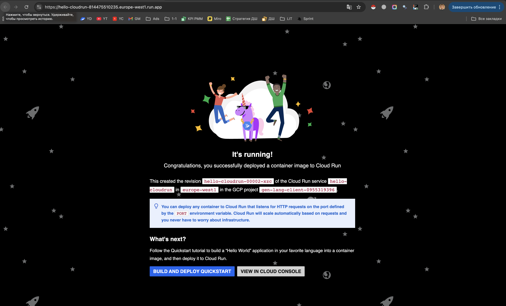
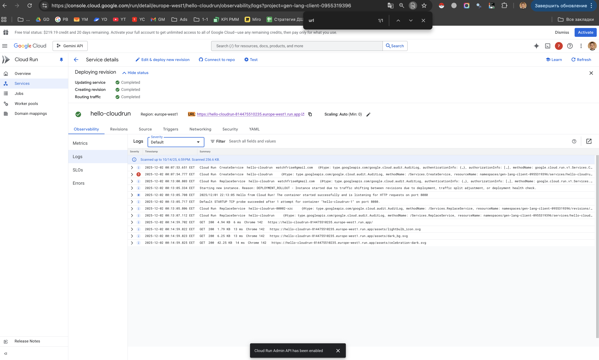
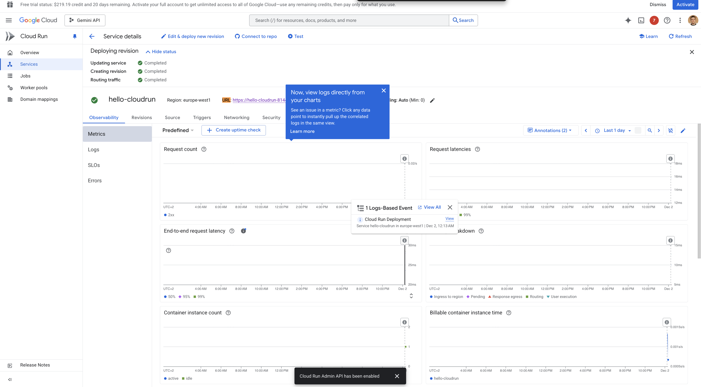
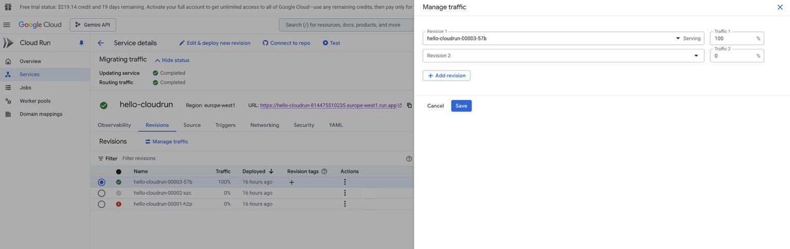

# Лабораторная работа №2 — Исследование Cloud Run

University: [ITMO University](https://itmo.ru/ru/)  
Faculty: FTMI  
Course: [introduction-in-web-tech](https://itmo-ict-faculty.github.io/introduction-in-web-tech)  
Year: 2025/2026  
Group: U4225  
Author: Гунин Никита Алексеевич
Date of create: 01.12.2025  
Date of finished: 01.12.2025

---

## Цель работы

Ознакомиться с работой **Cloud Run**:

- развернуть контейнерный сервис с минимальными ресурсами;
- протестировать его по публичному URL;
- изучить логи и метрики сервиса;
- изменить конфигурацию (порт) и понять, как это влияет на работу;
- попереключать трафик между разными ревизиями и сравнить поведение.

---

## Ход работы

### Шаг 1. Переход в Cloud Run и проверка, что сервисов нет

**Что сделал**

1. Я выбрал в Google Cloud Console раздел **Cloud Run**.
2. Я открыл вкладку **Services** и убедился, что ни одного сервиса ещё не создано.

**Зачем**

Перед созданием нового сервиса важно убедиться, что среда “чистая” и не перепутается с уже существующими. Это также фиксирует начальное состояние для отчёта.

**Скриншот**

---

### Шаг 2. Создание сервиса Hello в Cloud Run

**Что делал**

1. Я нажал **Create service**.
2. В качестве источника я выбрал развертывание из контейнерного образа (дефолтный hello-сервис из документации).
3. Я задал:
   - имя сервиса: `hello-cloudrun`;
   - регион: `europe-west1` (Бельгия);
   - минимальные ресурсы (минимальный объём памяти и CPU, автоскейлинг по запросам);
   - публичный доступ (Allow all traffic, unauthenticated).

После этого я запустил деплой.

**Зачем**

- Используем стандартный **Hello-сервис**, чтобы сосредоточиться на механике Cloud Run, а не на бизнес-логике приложения.
- Минимальные ресурсы — чтобы укладываться в бесплатный или почти бесплатный тариф.
- Публичный доступ позволяет сразу тестировать сервис по URL без дополнительной авторизации — удобно для лабораторной.

**Скриншот**

Сервис успешно создан, показаны ревизии и базовые параметры:

---

### Шаг 3. Тестирование сервиса по публичному URL

**Что делал**

1. В карточке сервиса я скопировал поле **URL** вида:

   `https://hello-cloudrun-814475510235.europe-west1.run.app`

2. Я открыл URL в браузере.
3. Я убедился, что отображается страница "It's running!" — контейнер успешно обрабатывает HTTP-запросы.

**Зачем**

Этот шаг подтверждает, что:

- контейнер был корректно развернут;
- Cloud Run настроил маршрутизацию и HTTPS-доступ;
- сервис отвечает на запросы “из интернета”, а не только внутри проекта.

**Скриншот**

Работающий Hello-сервис в браузере:

---

### Шаг 4. Просмотр логов сервиса

**Что делал**

1. Внутри сервиса `hello-cloudrun` я перешёл на вкладку **Observability → Logs**.
2. Я просмотрел список записей:
   - события `CreateService`;
   - создание и запуск ревизии;
   - запросы к URL из браузера (метод GET, HTTP-код 200 и т.д.).

**Зачем**

Логи — основной инструмент диагностики:

- показывают, как проходил деплой;
- фиксируют ошибки, если контейнер не стартовал;
- позволяют увидеть, как реальные HTTP-запросы доходят до сервиса.

**Скриншот**

Журнал логов для сервиса `hello-cloudrun`:

---

### Шаг 5. Анализ метрик Cloud Run

**Что делал**

1. Я перешёл на вкладку **Observability → Metrics**.
2. Я посмотрел преднастроенные графики:
   - **Request count** — сколько запросов пришло к сервису;
   - **End-to-end request latency** — задержка ответов;
   - **Container instance count** — сколько экземпляров контейнера было поднято Cloud Run.

**Зачем**

Метрики позволяют понять:

- как ведёт себя автоскейлинг Cloud Run;
- как меняется нагрузка;
- есть ли проблемы с производительностью (рост задержек при большом числе запросов).

В контексте лабораторной я вижу, что после первых запросов появляется небольшой всплеск на графиках, что подтверждает работу сервиса и сбор телеметрии.

**Скриншот**

Графики запросов, задержки и количества инстансов:

---

### Шаг 6. Изменение порта контейнера на 8090 и создание новой ревизии

**Что делал**

1. Я нажал **Edit & deploy new revision** для сервиса `hello-cloudrun`.
2. В настройках контейнера я изменил **Container port** с значения по умолчанию (8080) на **8090**.
3. Я сохранил изменения и задеплоил новую ревизию.
4. Я дождался окончания деплоя и убедился, что ревизия имеет статус **Serving**.

**Что ожидалось по заданию**

Задание предлагает поменять порт и *“посмотреть, что произойдет”*, подразумевая, что при несоответствии порта сервис может перестать корректно отвечать.

**Что произошло фактически**

Сервис продолжил успешно открываться по тому же URL. “Hello-страница” отдавала HTTP-200 и корректно отображалась.

**Почему так**

Cloud Run использует не “жёстко прописанный” порт, а переменную окружения `$PORT`, которую сам передаёт контейнеру. Пока приложение внутри контейнера слушает **тот порт, который приходит через `$PORT`**, смена значения в UI (Container port) не ломает работу — это скорее декларативная метка для платформы и инструментов.

В нашем случае стандартный hello-контейнер корректно слушает `$PORT`, поэтому изменение конфигурации не привело к ошибке.

---

### Шаг 7. Переключение трафика между ревизиями

**Что делал**

1. Я перешёл на вкладку **Revisions** сервиса `hello-cloudrun`.
2. Я убедился, что существует несколько ревизий:
   - ревизия, созданная при первом деплое (порт 8080);
   - ревизия, созданная после изменения порта на 8090.
3. Я нажал **Manage traffic**.
4. Я поочерёдно выставлял:
   - 100% трафика на ревизию с портом 8080;
   - 100% трафика на ревизию с портом 8090.
5. После каждого переключения я обновлял URL сервиса в браузере и проверял ответ.

**Зачем**

Этот шаг показывает ключевую фичу Cloud Run:

- можно иметь несколько ревизий одного сервиса;
- трафик между ними распределяется “ползунком” прямо в консоли;
- смена ревизии не требует простоя сервиса (zero-downtime deployment).

В боевом окружении это используется для **канареечного деплоя**: часть трафика отправляется на новую версию, наблюдаются метрики и логи, затем доля постепенно увеличивается.

**Наблюдения**

- При 100% трафика на любую из ревизий сервис продолжал корректно отвечать.
- Визуально контент был одинаковым (hello-страница), так как бизнес-логика не менялась, менялся только порт и конфигурация.

**Скриншот**

Экран распределения трафика между ревизиями:

---

## Результаты лабораторной работы

В результате выполнения лабораторной:

1. Освоен базовый workflow работы с **Cloud Run**:
   - создание сервиса из контейнерного образа;
   - выбор минимальных ресурсов и региона;
   - включение публичного доступа.
2. Сервис успешно протестирован по публичному URL.
3. Изучены:
   - логи деплоя и запросов;
   - базовые метрики (количество запросов, задержки, количество контейнеров).
4. Создана новая ревизия сервиса с изменённым портом (8090).
5. На практике проверено, что при корректной работе с переменной `$PORT` изменение порта в конфиге не ломает сервис.
6. Выполнено переключение трафика между двумя ревизиями и подтверждено, что Cloud Run позволяет управлять трафиком без простоя.

---

## Выводы

Cloud Run предоставляет удобный способ запуска контейнерных приложений без управления инфраструктурой:

- деплой сервиса и создание ревизий занимают минуты;
- логирование и метрики встроены “из коробки”;
- переключение трафика между версиями реализовано на уровне платформы и не требует доработок в самом приложении.

Поставленные в лабораторной цели достигнуты, сервис успешно развернут, проанализирован и модифицирован.
