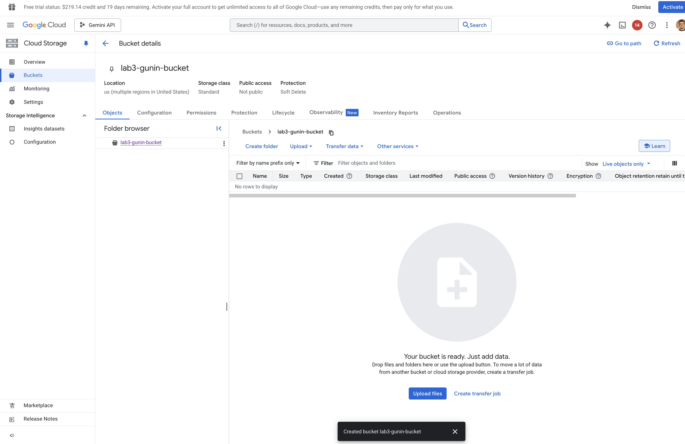
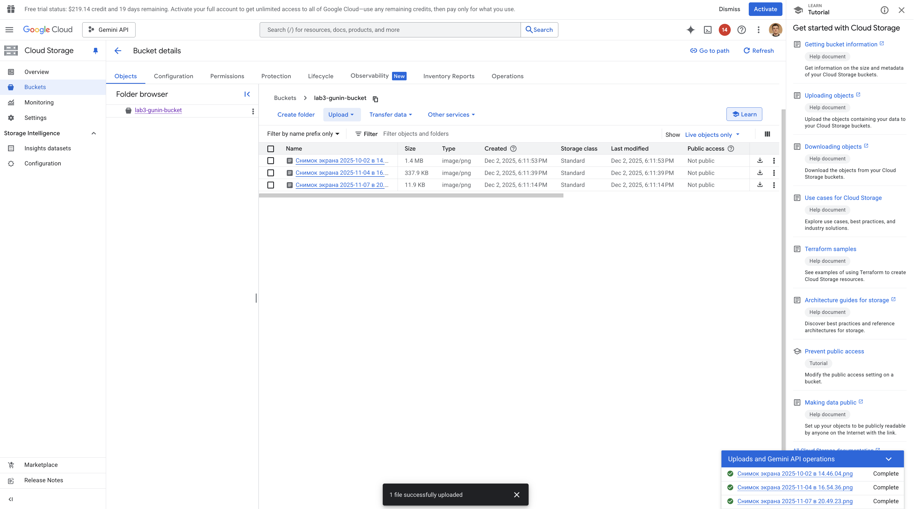
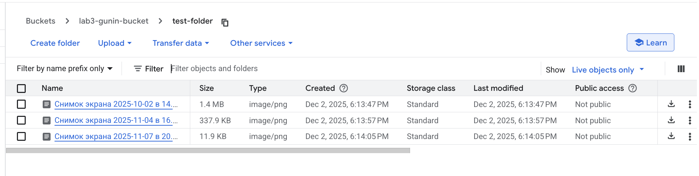
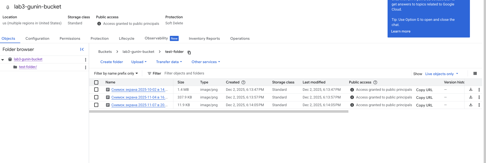

# Лабораторная работа №3 — Исследование Cloud Storage

University: [ITMO University](https://itmo.ru/ru/)  
Faculty: FTMI  
Course: [introduction-in-web-tech](https://itmo-ict-faculty.github.io/introduction-in-web-tech)  
Year: 2025/2026  
Group: U4225  
Author: Гунин Никита Алексеевич  
Lab: Lab3  
Date of create: 02.12.2025  
Date of finished: 02.12.2025

---

## Цель работы

Ознакомиться с основными принципами работы **Google Cloud Storage**, создать бакет, загрузить файлы, структурировать данные в папках и настроить публичный доступ.

---

## Ход работы

### Шаг 1. Переход в Cloud Storage и проверка, что бакетов нет

**Что делал**

1. Я перешёл в раздел **Cloud Storage → Buckets**.  
2. Я убедился, что список бакетов пуст.

**Зачем**

Это фиксирует начальное состояние проекта и показывает, что бакет создаётся с нуля.

**Скриншот**

---

### Шаг 2. Создание Cloud Storage bucket

**Что делал**

1. Я нажал кнопку **Create bucket**.  
2. Я указал имя бакета: `lab3-gunin-bucket`.  
3. Я оставил дефолтные настройки по региону, классу хранения и управлению объектами.  
4. Я подтвердил создание и получил новый пустой бакет.

**Зачем**

Создание бакета — базовый шаг работы с объектным хранилищем. Это пространство, в котором хранятся файлы любого типа.

**Скриншот**

---

### Шаг 3. Загрузка изображений и перемещение их в папку

**Что делал**

1. Я загрузил 3 изображения через кнопку **Upload**.  
2. Затем я создал папку `test-folder`.  
3. Я переместил все загруженные изображения внутрь папки.

**Зачем**

Этот шаг демонстрирует базовые операции с объектами: загрузку, создание структуры каталогов и перенос объектов.

**Скриншот**

Также созданная папка и перемещённые файлы:

---

### Шаг 4. Настройка публичного доступа

**Что делал**

1. Я открыл настройки доступа бакета.  
2. Я включил доступ для публичных principals, что позволило объектам внутри бакета становиться публичными.  
3. Я убедился, что каждый файл в папке `test-folder` получил статус **"Access granted to public principals"**.  

**Зачем**

Публичные объекты позволяют предоставлять прямые ссылки на файлы — важная функция для сайтов, статических ресурсов и общего доступа.

**Скриншот**

---

### Публичные ссылки на файлы

Я проверил, что ссылки работают и отдают изображения без авторизации:

- Картинка 1  
  https://storage.googleapis.com/lab3-gunin-bucket/test-folder/%D0%A1%D0%BD%D0%B8%D0%BC%D0%BE%D0%BA%20%D1%8D%D0%BA%D1%80%D0%B0%D0%BD%D0%B0%202025-10-02%20%D0%B2%2014.46.04.png

- Картинка 2  
  https://storage.googleapis.com/lab3-gunin-bucket/test-folder/%D0%A1%D0%BD%D0%B8%D0%BC%D0%BE%D0%BA%20%D1%8D%D0%BA%D1%80%D0%B0%D0%BD%D0%B0%202025-11-04%20%D0%B2%2016.54.36.png

- Картинка 3  
  https://storage.googleapis.com/lab3-gunin-bucket/test-folder/%D0%A1%D0%BD%D0%B8%D0%BC%D0%BE%D0%BA%20%D1%8D%D0%BA%D1%80%D0%B0%D0%BD%D0%B0%202025-11-07%20%D0%B2%2020.49.23.png

---

## Результаты лабораторной работы

В ходе работы я:

1. Создал новый Cloud Storage bucket.  
2. Загрузил несколько изображений.  
3. Создал папку и переместил файлы внутрь неё.  
4. Настроил публичный доступ на уровне бакета, в результате чего все объекты внутри стали доступны по публичным URL.  

---

## Выводы

Google Cloud Storage предоставляет удобный интерфейс для работы с объектами, позволяет легко управлять файлами, их структурами и доступами. Публичные ссылки работают сразу после настройки доступа и делают сервис удобным для использования в качестве файлового CDN и хранилища статических ресурсов.

